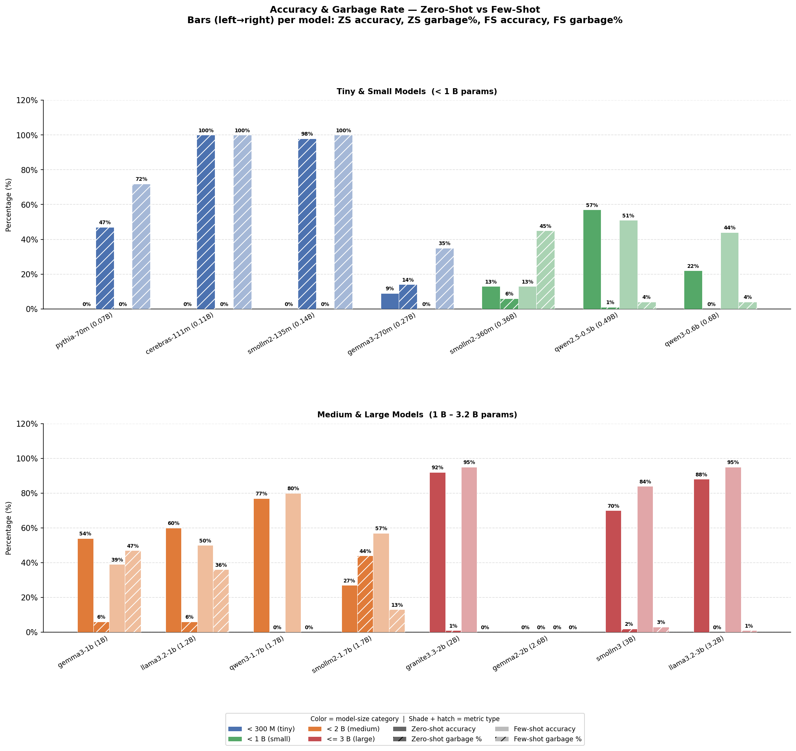
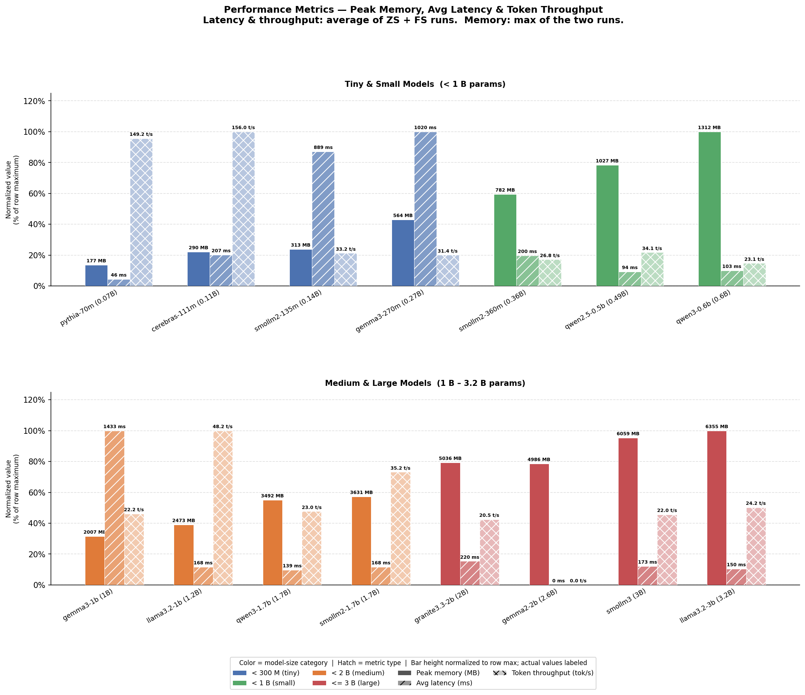
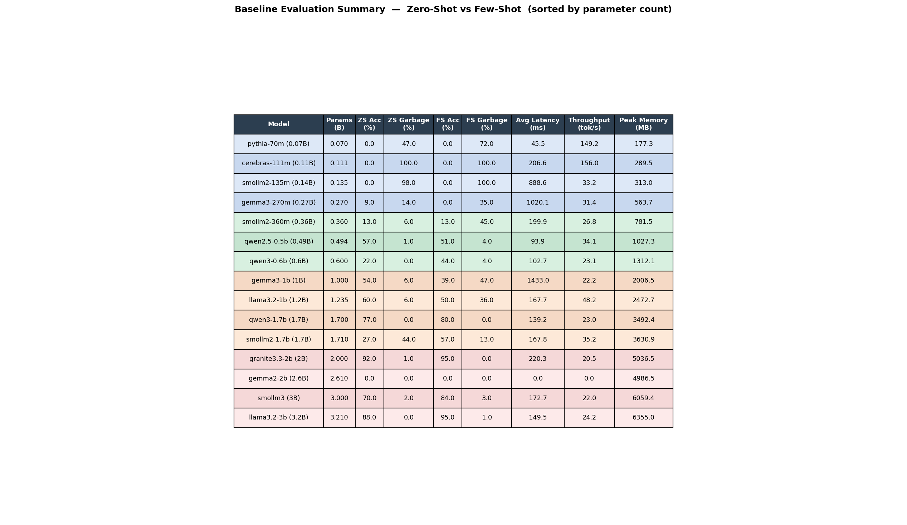

# Baseline Evaluation Final Report

## 1) Models chosen for baseline sweep (and why)

We evaluated 15 open(-weight) candidate models to cover a wide size range and architecture diversity before fine-tuning:

- Tiny: `pythia-70m`, `cerebras-111m`, `smollm2-135m`, `gemma3-270m`
- Small: `smollm2-360m`, `qwen2.5-0.5b`, `qwen3-0.6b`
- Medium: `gemma3-1b`, `llama3.2-1b`, `qwen3-1.7b`, `smollm2-1.7b`
- Large: `granite3.3-2b`, `gemma2-2b`, `smollm3`, `llama3.2-3b`

Why this sweep:

- Capture quality vs cost trade-offs across sizes.
- Compare model families (Qwen, Llama, SmolLM, Gemma, Granite, Pythia, Cerebras).
- Identify a final set suitable for downstream LoRA/QLoRA experiments.

## 2) Evaluation results (baseline)

### Accuracy + garbage output

Quick read:

- Best raw accuracy came from larger models (e.g., `granite3.3-2b`, `llama3.2-3b`).
- Some small/medium models improved significantly in few-shot mode
   (notably `smollm2-1.7b`, `qwen3-0.6b`).

### Performance (memory, latency, throughput)

Quick read:

- Large models were strongest on accuracy but costlier in memory.
- `qwen2.5-0.5b` and `qwen3-0.6b` provided better efficiency/quality balance.

### Combined summary table

## 3) Final 5 models chosen (and why)

Final set used for next-stage experiments:

1. `smollm2-360m`
   - Very low-memory anchor model for lightweight deployment and lower-bound comparison.
2. `qwen2.5-0.5b`
   - Strong efficiency-quality balance; stable behavior and low garbage rates.
3. `qwen3-0.6b`
    - Better instruction-following behavior than tiny models; good candidate
       for fine-tuning uplift.
4. `llama3.2-1b`
   - Widely used 1B-class baseline; useful cross-family reference.
5. `smollm2-1.7b`
   - Showed notable few-shot gain; good mid-size candidate for adaptation studies.

Selection rationale:

- Balanced memory tiers (small → medium).
- Good family diversity while keeping compute manageable.
- Strong expected fine-tuning upside, not only raw zero-shot ranking.

## 4) Models not chosen (and why)

Not selected for final 5:

- `pythia-70m`, `cerebras-111m`, `smollm2-135m`, `gemma3-270m`
  - Too weak baseline quality / high garbage under this task setup.
- `gemma3-1b`
  - Unfavorable latency-quality trade-off in our runs.
- `gemma2-2b`
  - No useful signal in these baseline outputs.
- `qwen3-1.7b`, `smollm3`, `granite3.3-2b`, `llama3.2-3b`
  - Stronger quality but higher resource cost; deprioritized to keep
      fine-tuning matrix tractable.

## 5) Other observations

- Few-shot prompting improved some models substantially, but gains were model-dependent.
- Garbage-rate behavior is as important as raw accuracy for tool-selection reliability.
- A mixed-size final set gives better insight into how LoRA/QLoRA scaling
   behaves than only picking top-accuracy large models.
