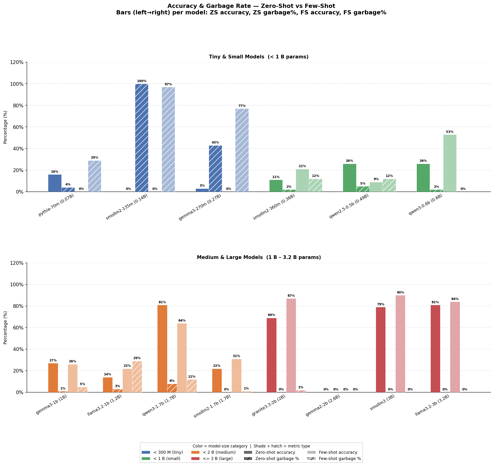
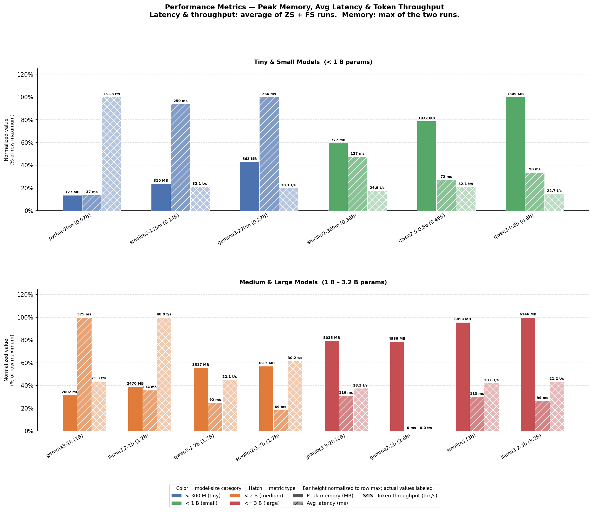
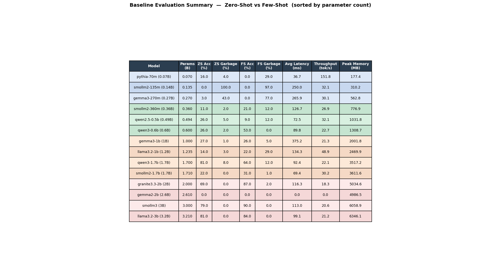

# Baseline Evaluation Final Report

## Baseline Setup

This baseline sweep evaluates tool routing before fine-tuning. The dataset files
remain unchanged: each example still stores `user_request`, `available_tools`,
and the ground-truth tool-name `answer`.

For v2.0 evaluation, the prompt builder assigns short positional tool IDs at
inference time:

- IDs are assigned in the order tools appear in each example: `a-z`, then
  `A-Z`.
- The model is asked to return only the tool ID.
- The no-match label is `-` instead of `none`.
- Reports still keep the original tool-name answer, and additionally include
  ID-level fields for scoring/debugging.

Fresh `20260825` reports are available for 14 models in the full zero-shot and
few-shot folders. `cerebras-111m` is not included in the fresh full-report set.

## Models Covered

The baseline sweep covers a wide range of model sizes and families:

- Tiny: `pythia-70m`, `smollm2-135m`, `gemma3-270m`
- Small: `smollm2-360m`, `qwen2.5-0.5b`, `qwen3-0.6b`
- Medium: `gemma3-1b`, `llama3.2-1b`, `qwen3-1.7b`, `smollm2-1.7b`
- Large: `granite3.3-2b`, `gemma2-2b`, `smollm3`, `llama3.2-3b`

Why this sweep:

- Measure quality vs resource cost under the ID-output prompt.
- Compare behavior across Qwen, Llama, SmolLM, Gemma, Granite, and Pythia
  families.
- Pick a manageable model set for downstream PEFT - LoRA experiments.

## Evaluation Results

### Accuracy And Garbage Output

Accuracy quick read:

- Best few-shot accuracy came from `smollm3` at 90%, `granite3.3-2b` at
  87%, and `llama3.2-3b` at 84%.
- Best zero-shot accuracy came from `qwen3-1.7b` and `llama3.2-3b` at 81%,
  followed by `smollm3` at 79%.
- `qwen3-0.6b` improved strongly from 26% zero-shot to 53% few-shot with 0%
  few-shot garbage.
- Few-shot prompting was not uniformly helpful: `qwen2.5-0.5b` dropped from
  26% to 9%, and `qwen3-1.7b` dropped from 81% to 64%.
- Tiny models remain weak under this setup, especially `smollm2-135m` and
  `gemma3-270m`.

### Performance

Performance quick read:

- Larger models gave the best accuracy but cost substantially more memory.
- `qwen3-0.6b` is the strongest small-model candidate in the fresh few-shot
  results.
- `smollm2-360m` remains useful as a low-memory lower-bound model, despite
  modest baseline accuracy.
- `llama3.2-1b` is not a top baseline performer here, but it remains valuable
  as a widely used 1B-class cross-family reference.

### Combined summary table

## Final 5 Models Chosen

Final set used for next-stage experiments:

- `smollm2-360m`: Low-memory anchor model for lightweight deployment and
  lower-bound comparison.
- `qwen2.5-0.5b`: Efficient Qwen 0.5B reference model; still useful for
  measuring whether fine-tuning recovers quality under the new ID-output format.
- `qwen3-0.6b`: Strongest selected small model in few-shot mode, with a large
  gain from prompting and clean garbage behavior.
- `llama3.2-1b`: Widely used 1B-class instruct baseline and useful cross-family
  reference.
- `smollm2-1.7b`: Mid-size selected model with moderate few-shot gain and
  manageable resource cost compared with the strongest 2B-3B candidates.

Selection rationale:

- Keep the fine-tuning matrix tractable.
- Preserve coverage across small and medium memory tiers.
- Include multiple architecture families rather than only the highest baseline
  scorers.
- Test fine-tuning upside on models that are not already near the top in
  baseline accuracy.

## Models Not Chosen

Not selected for final 5:

- `pythia-70m`, `smollm2-135m`, `gemma3-270m`: Too weak on the fresh
  ID-output baseline, with low accuracy and/or high garbage.
- `cerebras-111m`: Not present in the fresh `20260825` full baseline reports;
  not included in the v2.0 fine-tuning set.
- `gemma3-1b`: Baseline quality did not justify its latency/resource trade-off
  relative to the selected models.
- `gemma2-2b`: No useful signal in the fresh baseline outputs.
- `qwen3-1.7b`, `smollm3`, `granite3.3-2b`, `llama3.2-3b`: Stronger baseline
  quality, but higher resource cost; deprioritized to keep the fine-tuning
  matrix tractable.

## Observations

- The ID-output format gives cleaner scoring semantics: generated IDs are
  checked against the current example's valid ID set, while reports can still
  map predictions back to tool names.
- Few-shot examples help some models substantially, but can also steer other
  models away from their zero-shot behavior.
- The selected five are intentionally not the five highest-accuracy baselines;
  they are the best experimental set for studying fine-tuning behavior under
  practical compute constraints.
