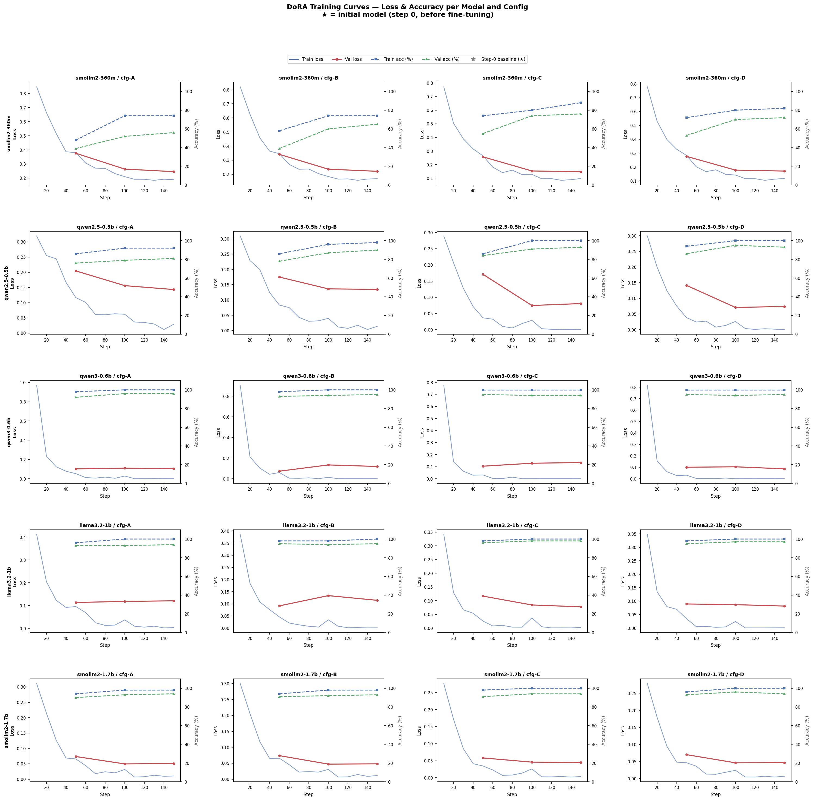
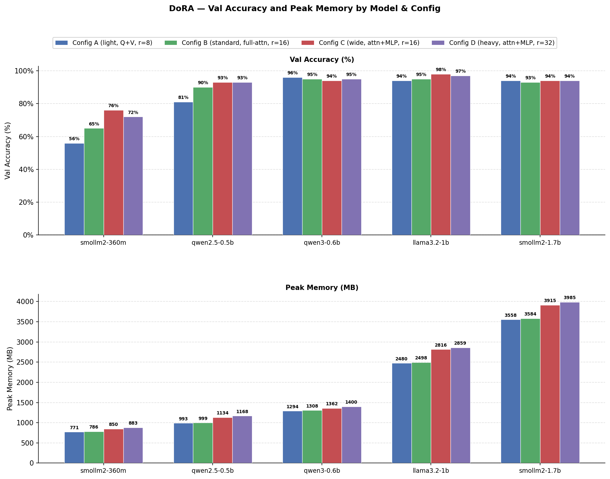
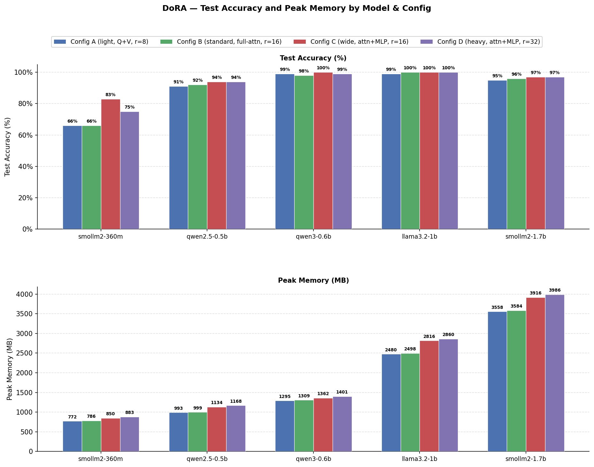

# DoRA Fine-Tuning — Final Report

**Task:** MCP tool-selection (intent classification) — given a user request and a
list of available tools, predict the correct tool name.

**Dataset:** 1k split — 800 train / 100 val / 100 test / 100 test-anchor.

**Technique:** DoRA (Weight-Decomposed Low-Rank Adaptation) via PEFT
`LoraConfig(use_dora=True)`. DoRA decomposes each adapted weight into a magnitude
vector and a direction matrix; only the direction is updated with a LoRA-style
low-rank decomposition while the magnitude vector is a free parameter. All base
weights are frozen.

**Training environment:** Google Colab L4 GPU (24 GB VRAM), bfloat16, 3 epochs,
`save_strategy="no"`, adapters pushed to
`kon172verma/intent-classifier` (subfolder `DoRA/{model}_{config}_1k`).

---

## 1. Experimental Setup

### 1.1 Models

| Key | HuggingFace ID | Total Params |
| --- | --- | --- |
| smollm2-360m | HuggingFaceTB/SmolLM2-360M-Instruct | 362.6 M |
| qwen2.5-0.5b | Qwen/Qwen2.5-0.5B-Instruct | 494.0 M |
| qwen3-0.6b | Qwen/Qwen3-0.6B | 596.0 M |
| llama3.2-1b | meta-llama/Llama-3.2-1B-Instruct | 1.24 B |
| smollm2-1.7b | HuggingFaceTB/SmolLM2-1.7B-Instruct | 1.71 B |

### 1.2 DoRA Configurations

DoRA uses the same config grid as LoRA, with `use_dora=True` added to each
`LoraConfig`. The per-config trainable-param counts below are for smollm2-360m and
include the extra magnitude vectors that DoRA introduces.

| Config | Target modules | Rank (r) | Alpha | Dropout | LR | Trainable params (smollm2-360m) |
| --- | --- | --- | --- | --- | --- | --- |
| A — Light | q\_proj, v\_proj | 8 | 16 | 0.05 | 2e-4 | 860 K (0.24%) |
| B — Standard | q, k, v, o\_proj | 16 | 32 | 0.05 | 1e-4 | 3,359 K (0.92%) |
| C — Wide | q, k, v, o\_proj + gate, up, down\_proj | 16 | 32 | 0.05 | 1e-4 | 8,960 K (2.42%) |
| D — Heavy | q, k, v, o\_proj + gate, up, down\_proj | 32 | 64 | 0.10 | 5e-5 | 17,644 K (4.65%) |

All configs: batch size 8 (Config D: 4), gradient accumulation 2 (D: 4),
3 epochs, cosine LR schedule, warmup ratio 0.05, gradient checkpointing enabled.

---

## 2. Training Results

All runs completed 150 steps (3 epochs × 50 steps/epoch at effective batch 16).

### 2.1 Trainable parameters

| Model | A | B | C | D |
| --- | --- | --- | --- | --- |
| smollm2-360m | 860 K (0.24%) | 3,359 K (0.92%) | 8,960 K (2.42%) | 17,644 K (4.65%) |
| qwen2.5-0.5b | 565 K (0.11%) | 2,212 K (0.45%) | 9,102 K (1.81%) | 17,901 K (3.50%) |
| qwen3-0.6b | 1,233 K (0.21%) | 4,731 K (0.79%) | 10,437 K (1.72%) | 20,529 K (3.33%) |
| llama3.2-1b | 893 K (0.07%) | 3,490 K (0.28%) | 11,649 K (0.93%) | 22,921 K (1.82%) |
| smollm2-1.7b | 1,671 K (0.10%) | 6,488 K (0.38%) | 18,727 K (1.08%) | 36,815 K (2.11%) |

DoRA adds magnitude vectors on top of the standard LoRA matrices, resulting in
**~1.6–7.5% more trainable parameters** than the equivalent LoRA config (average
+3.3% across all 20 runs).

### 2.2 Final train loss and training time

| Model | A | B | C | D |
| --- | --- | --- | --- | --- |
| smollm2-360m | 0.34 / 698 s | 0.30 / 911 s | 0.23 / 1,940 s | 0.25 / 1,596 s |
| qwen2.5-0.5b | 0.11 / 432 s | 0.08 / 608 s | 0.06 / 1,838 s | 0.06 / 879 s |
| qwen3-0.6b | 0.10 / 607 s | 0.09 / 770 s | 0.07 / 1,229 s | 0.07 / 1,019 s |
| llama3.2-1b | 0.07 / 493 s | 0.06 / 627 s | 0.05 / 1,639 s | 0.05 / 1,595 s |
| smollm2-1.7b | 0.06 / 972 s | 0.06 / 1,293 s | 0.05 / 3,122 s | 0.05 / 2,938 s |

*Format: final train-loss / training time.*

DoRA training is **1.2x–4.4x slower than LoRA** (see Section 6.3 for full
comparison). The overhead is highest for Config C on smaller models, where the
per-step weight-normalisation gradient is most expensive relative to the base
computation.

### 2.3 Peak training VRAM (MB)

| Model | A | B | C | D |
| --- | --- | --- | --- | --- |
| smollm2-360m | 1,674 | 1,799 | 2,447 | 1,804 |
| qwen2.5-0.5b | 2,162 | 2,195 | 2,807 | 2,293 |
| qwen3-0.6b | 2,574 | 2,634 | 3,018 | 2,688 |
| llama3.2-1b | 4,512 | 4,557 | 5,860 | 4,620 |
| smollm2-1.7b | 5,343 | 5,652 | 7,660 | 6,092 |

Config C (wide, attn+MLP) shows a pronounced VRAM spike for larger models
(up to 7,660 MB for smollm2-1.7b). Config D uses half the batch size which
partially compensates, keeping its VRAM below Config C despite higher rank.

---

## 3. Validation Results

Evaluated on 100 held-out val examples. Adapter loaded from HF Hub without merging.

### 3.1 Validation accuracy (%)

| Model | A | B | C | D | Best |
| --- | --- | --- | --- | --- | --- |
| smollm2-360m | 56 | 65 | **76** | 72 | C |
| qwen2.5-0.5b | 81 | 90 | 93 | **93** | C / D |
| qwen3-0.6b | **96** | 95 | 94 | 95 | A |
| llama3.2-1b | 94 | 95 | **98** | 97 | C |
| smollm2-1.7b | **94** | 93 | **94** | **94** | A / C / D |

### 3.2 Peak inference memory (MB)

| Model | A | B | C | D |
| --- | --- | --- | --- | --- |
| smollm2-360m | 771 | 786 | 850 | 883 |
| qwen2.5-0.5b | 993 | 999 | 1,134 | 1,168 |
| qwen3-0.6b | 1,294 | 1,308 | 1,362 | 1,400 |
| llama3.2-1b | 2,480 | 2,498 | 2,816 | 2,859 |
| smollm2-1.7b | 3,558 | 3,584 | 3,915 | 3,985 |

### 3.3 Median inference latency — p50 (ms)

| Model | A | B | C | D |
| --- | --- | --- | --- | --- |
| smollm2-360m | 385 | 518 | 912 | 796 |
| qwen2.5-0.5b | 214 | 320 | 478 | 475 |
| qwen3-0.6b | 289 | 396 | 594 | 589 |
| llama3.2-1b | 151 | 223 | 842 | 850 |
| smollm2-1.7b | 304 | 437 | 1,773 | 1,792 |

DoRA inference latency is substantially higher than LoRA — see Section 6.3
for a full comparison. The overhead comes from the unmerged magnitude
normalisation applied on every forward pass.

---

## 4. Test Results

Evaluated on 100 held-out test examples (locked split, evaluated once).

### 4.1 Test accuracy (%)

| Model | A | B | C | D | Best |
| --- | --- | --- | --- | --- | --- |
| smollm2-360m | 66 | 66 | **83** | 75 | C |
| qwen2.5-0.5b | 91 | 92 | **94** | **94** | C / D |
| qwen3-0.6b | 99 | 98 | **100** | 99 | C |
| llama3.2-1b | 99 | **100** | **100** | **100** | B / C / D |
| smollm2-1.7b | **95** | 96 | 97 | 97 | C / D |

### 4.2 Peak inference memory — test

Identical to val (same inference path and hardware): see Section 3.2.

---

## 5. Analysis and Observations

### 5.1 Config C remains the best general-purpose choice

Config C achieves the highest or joint-highest test accuracy for 4 out of 5 models
(smollm2-360m, qwen3-0.6b, llama3.2-1b, smollm2-1.7b), consistent with the
pattern seen in LoRA. Including MLP projection matrices (gate, up, down) alongside
attention projections provides a meaningful accuracy boost, especially for the
smallest model: smollm2-360m jumps from 66% (A) to 83% (C).

### 5.2 smollm2-360m remains the weakest model

At 56–76% val and 66–83% test, smollm2-360m lags all other models by a large
margin regardless of config. The pattern is the same as with LoRA: insufficient
model capacity for 20-class intent classification rather than an adapter issue.
DoRA Config C gives a marginal 2% test improvement over LoRA (83% vs 81%),
suggesting the magnitude-decomposition helps slightly on low-capacity models.

### 5.3 Larger models saturate at 97–100% with any config

qwen3-0.6b, llama3.2-1b, and smollm2-1.7b all reach 97–100% test accuracy across
all four configs. For these models, config choice has at most a 5-point spread and
the performance ceiling is driven by dataset size (800 training examples across
20 classes) rather than adapter expressivity.

### 5.4 Val and test accuracy are well-aligned

Val vs test accuracy differences are within 4 percentage points for all 20 runs,
confirming the val split is a reliable proxy. In several cases test accuracy
exceeds val accuracy (e.g., smollm2-360m C: val 76%, test 83%), consistent with
the LoRA findings.

### 5.5 Unmerged inference has significant latency overhead

DoRA adapters were evaluated without calling `merge_and_unload()`. When adapters
are not merged, every forward pass must apply the magnitude normalisation inline,
adding substantial per-layer overhead. Config C shows the worst latency
(842–1,773 ms p50 vs 169–442 ms for LoRA). For production deployment, merging
the DoRA adapter into the base weights eliminates this overhead entirely and
restores LoRA-equivalent inference speed.

---

## 6. Comparison with LoRA

### 6.1 Test accuracy — DoRA vs LoRA (%)

| Model | Config | LoRA | DoRA | Δ |
| --- | --- | --- | --- | --- |
| smollm2-360m | A | 63 | 66 | +3 |
| smollm2-360m | B | 65 | 66 | +1 |
| smollm2-360m | C | 81 | **83** | +2 |
| smollm2-360m | D | 70 | 75 | +5 |
| qwen2.5-0.5b | A | 89 | 91 | +2 |
| qwen2.5-0.5b | B | 92 | 92 | 0 |
| qwen2.5-0.5b | C | **95** | 94 | −1 |
| qwen2.5-0.5b | D | **95** | 94 | −1 |
| qwen3-0.6b | A | **100** | 99 | −1 |
| qwen3-0.6b | B | 98 | 98 | 0 |
| qwen3-0.6b | C | 99 | **100** | +1 |
| qwen3-0.6b | D | 99 | 99 | 0 |
| llama3.2-1b | A | **100** | 99 | −1 |
| llama3.2-1b | B | **100** | **100** | 0 |
| llama3.2-1b | C | **100** | **100** | 0 |
| llama3.2-1b | D | **100** | **100** | 0 |
| smollm2-1.7b | A | 94 | **95** | +1 |
| smollm2-1.7b | B | 95 | 96 | +1 |
| smollm2-1.7b | C | 97 | 97 | 0 |
| smollm2-1.7b | D | **98** | 97 | −1 |

**Summary:** DoRA is within ±1–3% of LoRA on every run. DoRA wins slightly on
smollm2-360m (+2–5% test accuracy gain), is neutral on mid-size models, and
marginally trails on a handful of qwen2.5-0.5b and qwen3-0.6b configs. The
differences are not statistically significant on a 100-sample test set.

### 6.2 Trainable parameter overhead

| Model | Avg LoRA params | Avg DoRA params | Overhead |
| --- | --- | --- | --- |
| smollm2-360m | 7,537 K | 7,706 K | +2.2% |
| qwen2.5-0.5b | 7,275 K | 7,445 K | +2.3% |
| qwen3-0.6b | 9,003 K | 9,233 K | +2.6% |
| llama3.2-1b | 9,519 K | 9,738 K | +2.3% |
| smollm2-1.7b | 15,532 K | 15,924 K | +2.5% |

*Averages computed across configs A–D. DoRA overhead is consistently +1.6–7.5%
depending on how many modules are targeted (Config A highest relative overhead,
Config D lowest).*

### 6.3 Training time ratio (DoRA / LoRA)

| Model | A | B | C | D |
| --- | --- | --- | --- | --- |
| smollm2-360m | 2.1× | 2.3× | 3.6× | 3.0× |
| qwen2.5-0.5b | 1.8× | 2.2× | 4.4× | 2.2× |
| qwen3-0.6b | 1.3× | 1.5× | 1.9× | 1.9× |
| llama3.2-1b | 1.2× | 1.4× | 2.6× | 3.0× |
| smollm2-1.7b | 1.3× | 1.6× | 2.7× | 3.2× |

DoRA's per-step cost is higher due to weight-normalisation in the backward pass.
Config C (wide, attn+MLP) amplifies this because more weight matrices are
decomposed per layer. Larger models show lower relative overhead because their
base FLOPs dominate.

### 6.4 Peak training VRAM overhead (DoRA − LoRA, MB)

| Model | A | B | C | D |
| --- | --- | --- | --- | --- |
| smollm2-360m | +52 | +84 | +419 | +236 |
| qwen2.5-0.5b | +1 | +6 | +504 | +8 |
| qwen3-0.6b | +2 | +3 | +292 | +5 |
| llama3.2-1b | +1 | +3 | +1,171 | +10 |
| smollm2-1.7b | +145 | +287 | +1,458 | +930 |

Configs A and B have negligible VRAM overhead. Config C spikes significantly
(up to +1,458 MB for smollm2-1.7b) because DoRA must store intermediate
normalisation buffers for each of the 7 targeted module types during the backward
pass.

### 6.5 Inference latency ratio (DoRA / LoRA, p50)

| Model | A | B | C | D |
| --- | --- | --- | --- | --- |
| smollm2-360m | 1.3× | 1.7× | 2.1× | 1.9× |
| qwen2.5-0.5b | 1.4× | 1.7× | 2.0× | 2.0× |
| qwen3-0.6b | 1.4× | 1.6× | 1.9× | 1.9× |
| llama3.2-1b | 1.4× | 1.7× | 5.0× | 5.0× |
| smollm2-1.7b | 1.4× | 1.7× | 5.0× | 4.9× |

This overhead is entirely an **artefact of unmerged inference**. When the
adapter is merged (`model.merge_and_unload()`), the magnitude normalisation is
absorbed into the weight matrices and inference speed matches LoRA. All
inference measurements in this report used unmerged adapters loaded directly
from the HF Hub, consistent with how the LoRA baselines were evaluated.

---

## 7. Best Runs Per Model

| Model | Best config | Test acc | Inference mem | p50 latency |
| --- | --- | --- | --- | --- |
| smollm2-360m | C | 83% | 850 MB | 912 ms |
| qwen2.5-0.5b | C or D | 94% | 1,134–1,168 MB | 475–478 ms |
| qwen3-0.6b | C | 100% | 1,362 MB | 594 ms |
| llama3.2-1b | B, C, or D | 100% | 2,498–2,859 MB | 223–850 ms |
| smollm2-1.7b | C or D | 97% | 3,915–3,985 MB | 1,773–1,792 ms |

For deployments that require low latency, **llama3.2-1b Config B** achieves 100%
test accuracy at 223 ms p50 (unmerged) — the best accuracy-per-latency point.
With merging, all DoRA models recover LoRA-equivalent latency, making
**qwen3-0.6b Config A** the best accuracy-per-VRAM option at 100% test accuracy
and 1,294 MB inference memory.

---

## 8. Artefacts

| Artefact | Location |
| --- | --- |
| Training reports (JSON) | `finetune_DoRA/reports_training/` |
| Validation reports (JSON) | `finetune_DoRA/reports_validation/` |
| Test reports (JSON) | `finetune_DoRA/reports_test/` |
| Adapters (HF Hub) | `kon172verma/intent-classifier` → `DoRA/{model}_{config}_1k/` |
| Training curves chart | `finetune_DoRA/analysis/dora_training_curves.png` |
| Combined train chart | `finetune_DoRA/analysis/dora_combined_train.png` |
| Combined val chart | `finetune_DoRA/analysis/dora_combined_val.png` |
| Combined test chart | `finetune_DoRA/analysis/dora_combined_test.png` |
