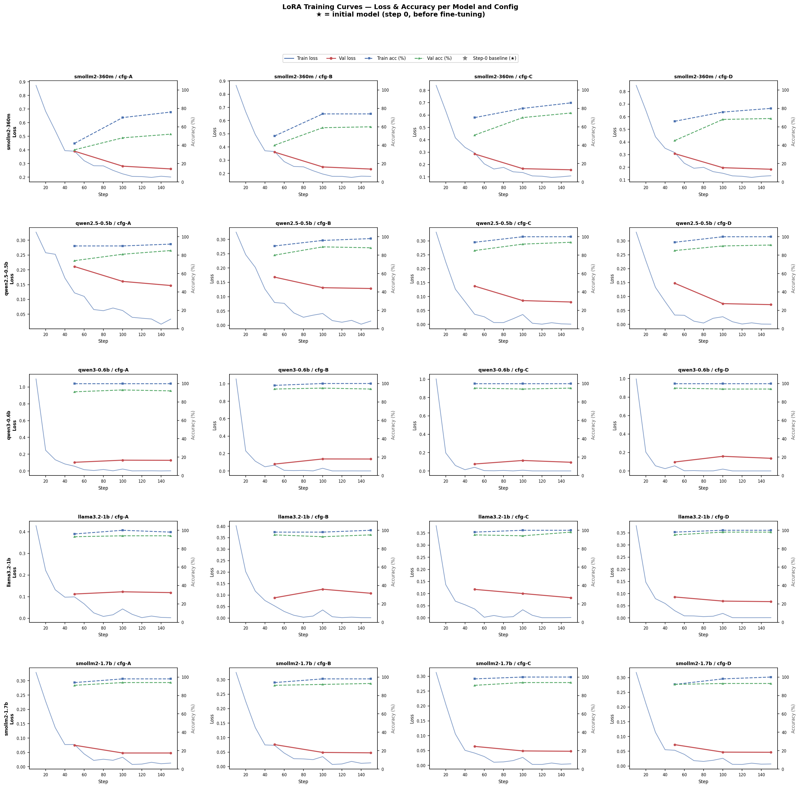
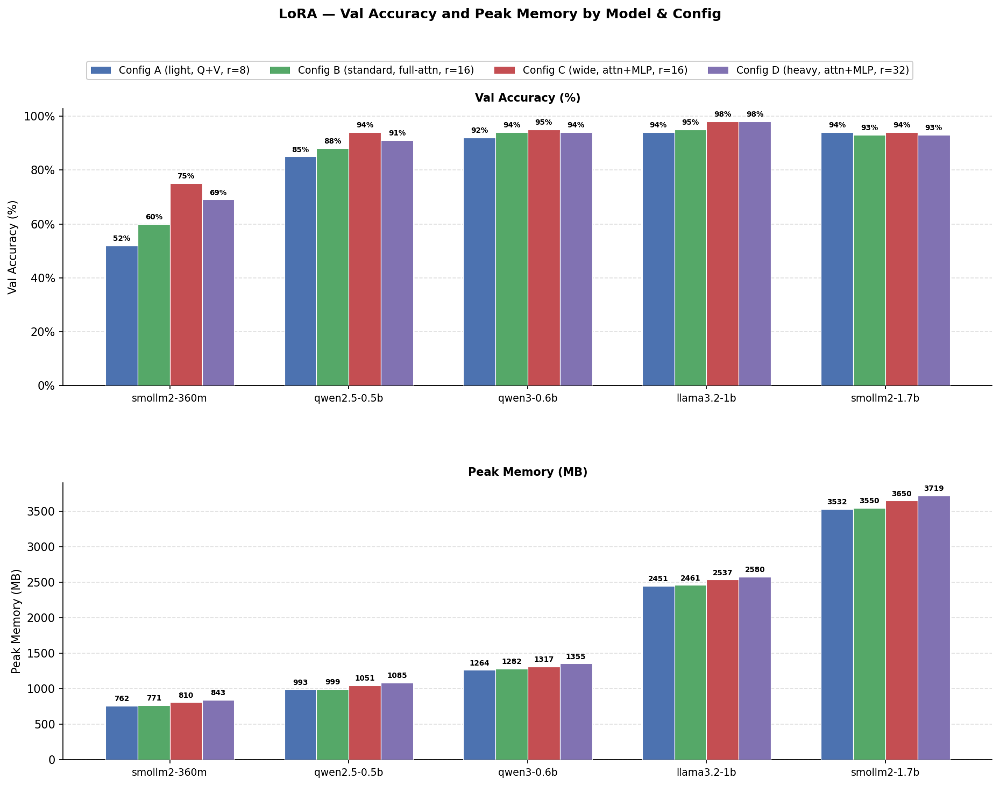
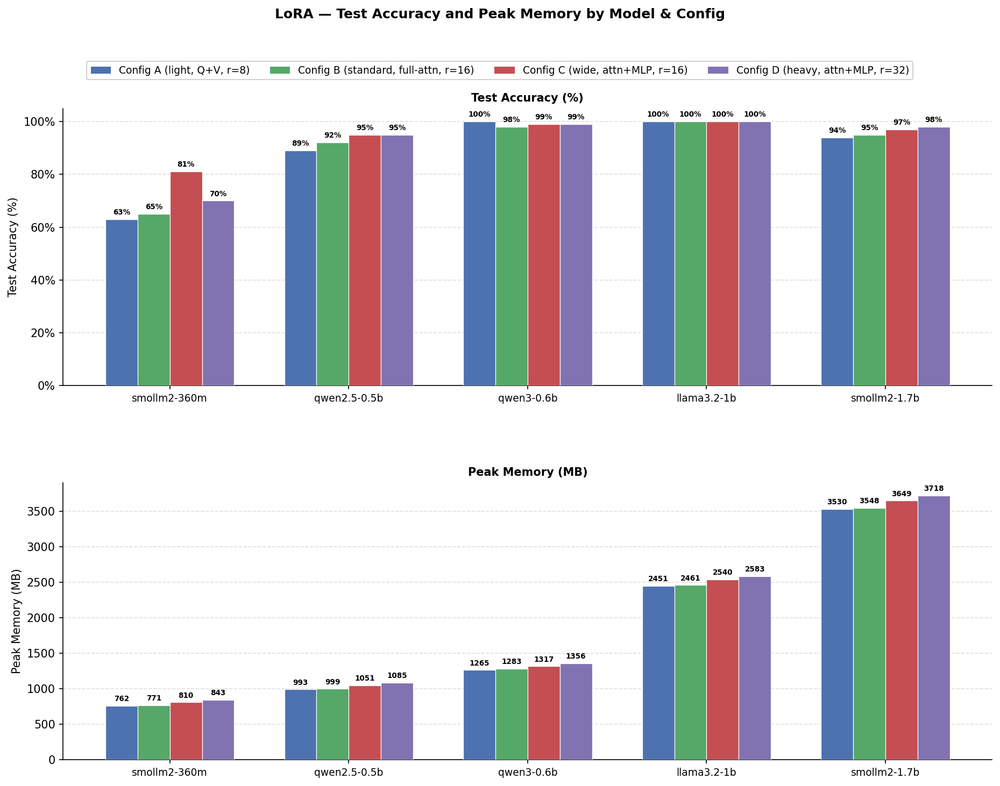

# LoRA Fine-Tuning — Final Report

**Task:** MCP tool-selection (intent classification) — given a user request and a
list of available tools, predict the correct tool name.

**Dataset:** 1k split — 800 train / 100 val / 100 test / 100 test-anchor.

**Technique:** LoRA (Low-Rank Adaptation) via PEFT. All base weights are frozen;
only the injected low-rank matrices are trained.

**Training environment:** Google Colab L4 GPU (24 GB VRAM), bfloat16, 3 epochs,
`save_strategy="no"`, adapters pushed to
`kon172verma/intent-classifier` (subfolder `LoRA/{model}_{config}_1k`).

---

## 1. Experimental Setup

### 1.1 Models

| Key | HuggingFace ID | Total Params |
| --- | --- | --- |
| smollm2-360m | HuggingFaceTB/SmolLM2-360M-Instruct | 362.6 M |
| qwen2.5-0.5b | Qwen/Qwen2.5-0.5B-Instruct | 494.0 M |
| qwen3-0.6b | Qwen/Qwen3-0.6B | 596.0 M |
| llama3.2-1b | meta-llama/Llama-3.2-1B-Instruct | 1.24 B |
| smollm2-1.7b | HuggingFaceTB/SmolLM2-1.7B-Instruct | 1.71 B |

### 1.2 LoRA Configurations

| Config | Target modules | Rank (r) | Alpha | Dropout | LR | Trainable params (smollm2-360m) |
| --- | --- | --- | --- | --- | --- | --- |
| A — Light | q_proj, v_proj | 8 | 16 | 0.05 | 2e-4 | 819 K (0.23%) |
| B — Standard | q, k, v, o\_proj | 16 | 32 | 0.05 | 1e-4 | 3.3 M (0.90%) |
| C — Wide | q, k, v, o\_proj + gate, up, down\_proj | 16 | 32 | 0.05 | 1e-4 | 8.7 M (2.39%) |
| D — Heavy | q, k, v, o\_proj + gate, up, down\_proj | 32 | 64 | 0.10 | 5e-5 | 17.4 M (4.79%) |

All configs: batch size 8 (Config D: 4), gradient accumulation 2 (D: 4),
3 epochs, cosine LR schedule, warmup ratio 0.05, gradient checkpointing enabled.

---

## 2. Training Results

All runs completed 150 steps (3 epochs × 50 steps/epoch at effective batch 16).

### 2.1 Final train loss and training time

| Model | A | B | C | D |
| --- | --- | --- | --- | --- |
| smollm2-360m | 0.26 / 340 s | 0.23 / 392 s | 0.16 / 545 s | 0.18 / 524 s |
| qwen2.5-0.5b | 0.15 / 239 s | 0.13 / 272 s | 0.08 / 416 s | 0.07 / 404 s |
| qwen3-0.6b | 0.13 / 458 s | 0.14 / 514 s | 0.09 / 634 s | 0.14 / 529 s |
| llama3.2-1b | 0.12 / 397 s | 0.11 / 442 s | 0.08 / 623 s | 0.07 / 525 s |
| smollm2-1.7b | 0.05 / 735 s | 0.05 / 823 s | 0.05 / 1143 s | 0.05 / 924 s |

*Format: final val-loss / training time.*

### 2.2 Peak training VRAM (MB)

| Model | A | B | C | D |
| --- | --- | --- | --- | --- |
| smollm2-360m | 1,622 | 1,715 | 2,028 | 1,568 |
| qwen2.5-0.5b | 2,161 | 2,189 | 2,302 | 2,285 |
| qwen3-0.6b | 2,572 | 2,631 | 2,726 | 2,683 |
| llama3.2-1b | 4,510 | 4,554 | 4,689 | 4,610 |
| smollm2-1.7b | 5,198 | 5,365 | 6,202 | 5,162 |

Config D uses half the batch size (4 vs 8), which partially offsets the larger
adapter, hence its VRAM is not always the highest.

---

## 3. Validation Results

Evaluated on 100 held-out val examples. Adapter loaded from HF Hub.

### 3.1 Validation accuracy (%)

| Model | A | B | C | D | Best |
| --- | --- | --- | --- | --- | --- |
| smollm2-360m | 52 | 60 | **75** | 69 | C |
| qwen2.5-0.5b | 85 | 88 | **94** | 91 | C |
| qwen3-0.6b | 92 | 94 | **95** | 94 | C |
| llama3.2-1b | 94 | 95 | **98** | **98** | C / D |
| smollm2-1.7b | 94 | 93 | **94** | 93 | A / C |

### 3.2 Peak inference memory (MB)

| Model | A | B | C | D |
| --- | --- | --- | --- | --- |
| smollm2-360m | 762 | 771 | 810 | 843 |
| qwen2.5-0.5b | 993 | 999 | 1,051 | 1,085 |
| qwen3-0.6b | 1,264 | 1,282 | 1,317 | 1,355 |
| llama3.2-1b | 2,451 | 2,461 | 2,537 | 2,580 |
| smollm2-1.7b | 3,532 | 3,550 | 3,650 | 3,719 |

### 3.3 Median inference latency — p50 (ms)

| Model | A | B | C | D |
| --- | --- | --- | --- | --- |
| smollm2-360m | 292 | 303 | 442 | 419 |
| qwen2.5-0.5b | 157 | 188 | 244 | 243 |
| qwen3-0.6b | 209 | 249 | 313 | 317 |
| llama3.2-1b | 110 | 131 | 169 | 169 |
| smollm2-1.7b | 213 | 257 | 355 | 346 |

---

## 4. Test Results

Evaluated on 100 held-out test examples (locked split, evaluated once).

### 4.1 Test accuracy (%)

| Model | A | B | C | D | Best |
| --- | --- | --- | --- | --- | --- |
| smollm2-360m | 63 | 65 | **81** | 70 | C |
| qwen2.5-0.5b | 89 | 92 | **95** | **95** | C / D |
| qwen3-0.6b | **100** | 98 | 99 | 99 | A |
| llama3.2-1b | **100** | **100** | **100** | **100** | all |
| smollm2-1.7b | 94 | 95 | 97 | **98** | D |

### 4.2 Peak inference memory (MB) — test

Identical to val (same inference path): see Section 3.2.

---

## 5. Analysis and Observations

### 5.1 Config C is the best general-purpose choice

Config C (wide, attn+MLP, r=16) achieves the highest or joint-highest test
accuracy for 4 out of 5 models. The MLP projection matrices (gate, up, down)
carry substantial task-relevant information for classification, so including them
in the adapter is worth the ~6% VRAM increase over Config B.

Config D (heavy, r=32) matches C on larger models but trails on smollm2-360m,
likely because rank 32 with only 800 training examples causes slight overfitting
on this small model.

### 5.2 Model size and architecture matter more than config choice for large models

qwen3-0.6b and llama3.2-1b reach 98–100% test accuracy across all four configs.
The performance gap between A and D is only 1–2 percentage points for these
models. By contrast, smollm2-360m shows a 18-point spread between A (63%) and
C (81%) — config selection has outsized impact on smaller models.

### 5.3 smollm2-360m generalises poorly

smollm2-360m is the clear outlier: 76–86% train accuracy but only 63–81% test
accuracy — a 5–19 point gap. This pattern (low train accuracy, large
train/test gap) points to insufficient model capacity rather than overfitting.
With 1k training examples and 800 training examples, 360M parameters struggle to
both memorise and generalise the 20-class classification task, especially with
Config A which freezes 99.8% of parameters.

### 5.4 Val and test accuracy are well-aligned

Across all 20 runs, val vs test accuracy differs by at most 6 percentage points,
confirming the val split is a reliable proxy for held-out performance. There is no
sign of val-overfitting; in several cases test accuracy exceeds val accuracy
(e.g., smollm2-360m Config C: val 75%, test 81%).

### 5.5 Inference latency vs accuracy trade-off

llama3.2-1b achieves 100% test accuracy with the lowest p50 latency (109–171 ms)
despite having 3× more parameters than smollm2-360m. smollm2-360m is slowest
for Configs C/D (442–467 ms) with significantly worse accuracy. This is a
consequence of the smaller model generating tokens more slowly relative to its
capacity than larger, more optimised models.

---

## 6. Best Runs Per Model

| Model | Best config | Test acc | Inference mem | p50 latency |
| --- | --- | --- | --- | --- |
| smollm2-360m | C | 81% | 810 MB | 466 ms |
| qwen2.5-0.5b | C or D | 95% | 1,051–1,085 MB | 243 ms |
| qwen3-0.6b | A | 100% | 1,265 MB | 208 ms |
| llama3.2-1b | any | 100% | 2,451–2,583 MB | 109–171 ms |
| smollm2-1.7b | D | 98% | 3,718 MB | 367 ms |

For deployment where memory is constrained, **qwen3-0.6b Config A** offers 100%
test accuracy at 1,265 MB and 208 ms — the best accuracy-per-MB ratio. For
unconstrained deployment, **llama3.2-1b** is the clear winner on accuracy and
latency.

---

## 7. Artefacts

| Artefact | Location |
| --- | --- |
| Training reports (JSON) | `finetune_LoRA/reports_training/` |
| Validation reports (JSON) | `finetune_LoRA/reports_validation/` |
| Test reports (JSON) | `finetune_LoRA/reports_test/` |
| Adapters (HF Hub) | `kon172verma/intent-classifier` → `LoRA/{model}_{config}_1k/` |
| Training curves chart | `finetune_LoRA/analysis/lora_training_curves.png` |
| Combined train chart | `finetune_LoRA/analysis/lora_combined_train.png` |
| Combined val chart | `finetune_LoRA/analysis/lora_combined_val.png` |
| Combined test chart | `finetune_LoRA/analysis/lora_combined_test.png` |
