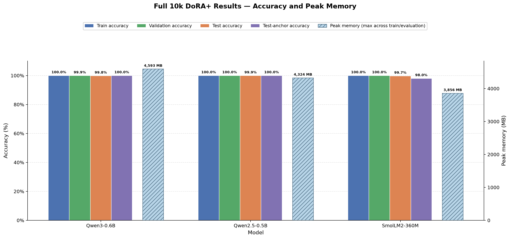
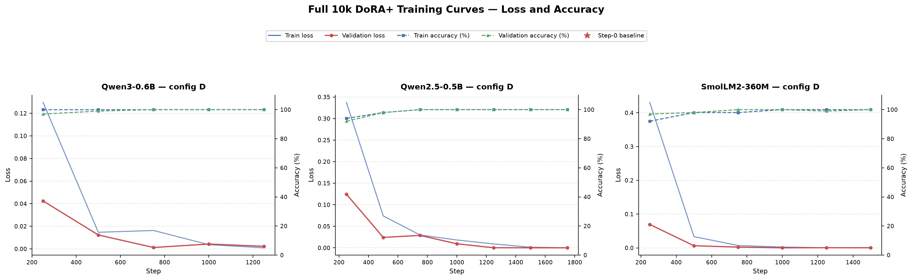
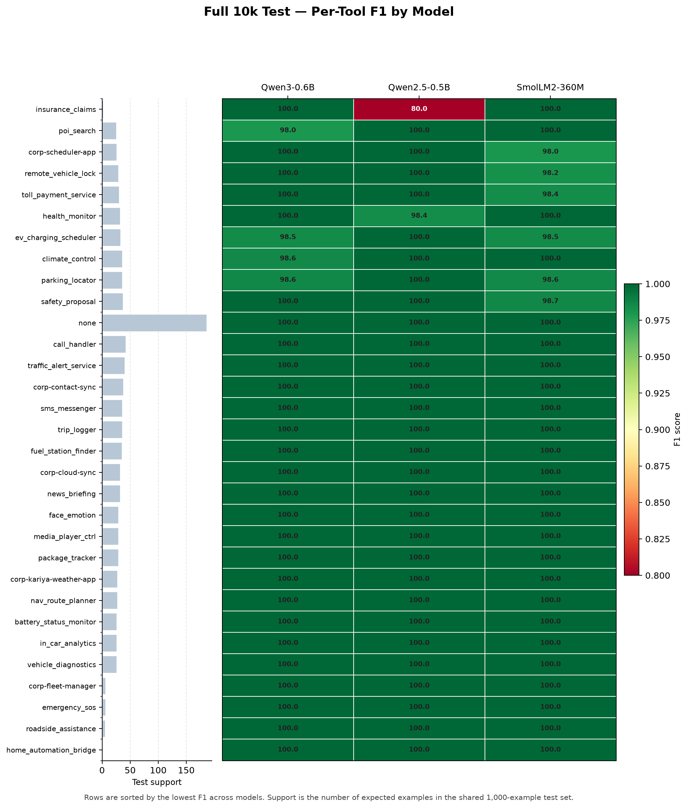
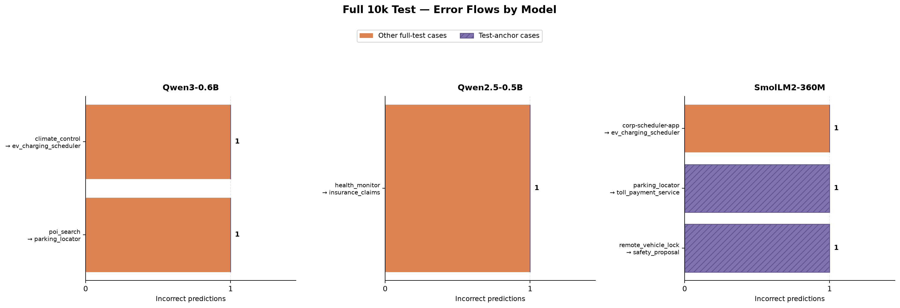
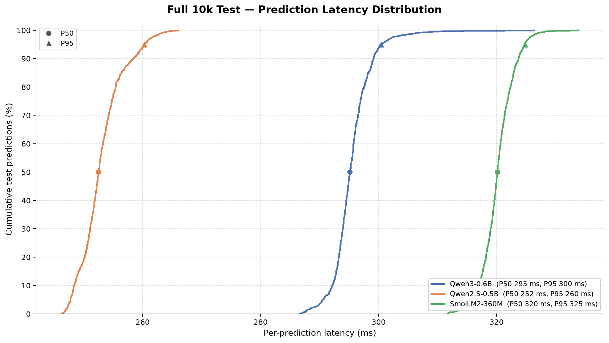

# Full-Dataset DoRA+ Fine-Tuning Final Report

## Scope

This report covers the completed v2.1 full-dataset experiments: DoRA+ adapters
trained with configuration D on the 10k dataset for Qwen3-0.6B,
Qwen2.5-0.5B-Instruct, and SmolLM2-360M-Instruct. The dataset uses the 80/10/10
split: 8,000 training examples and 1,000 examples each for validation and the
held-out test set. The `test_anchor` result is a fixed 100-example subset of the
test set used to make a directly comparable check across runs.

The task uses the `tool_id_v1` positional-ID renderer: models predict the
rendered tool ID rather than a tool name. All accuracy values below are
exact-match classification accuracy.

## Configuration

All three experiments use DoRA+ configuration D (Heavy): rank 32 adapters over
the attention projections (`q`, `k`, `v`, `o`) and MLP projections (`gate`,
`up`, `down`), with alpha 64, dropout 0.1, effective batch size 16, and a
5e-5 learning rate. Training was configured for up to four epochs with
gradient checkpointing and early stopping (patience 2).

## Results

| Model | Train | Validation | Test | Test anchor | Test correct | P50 / P95 latency | Peak memory |
| --- | ---: | ---: | ---: | ---: | ---: | ---: | ---: |
| Qwen3-0.6B | 100.0% | 99.9% | 99.8% | 100.0% | 998 / 1,000 | 295 / 300 ms | 4,593 MB |
| Qwen2.5-0.5B | 100.0% | 100.0% | 99.9% | 100.0% | 999 / 1,000 | 253 / 260 ms | 4,324 MB |
| SmolLM2-360M | 100.0% | 100.0% | 99.7% | 98.0% | 997 / 1,000 | 320 / 325 ms | 3,856 MB |

Peak memory is the maximum observed across each model's training and evaluation
runs. The test row uses the shared 1,000-example held-out split; the anchor is
reported separately because it is a subset, not an additional independent test
set.

## Findings

- All three adapters generalize at 99.7% or higher on the 1,000-example test
  set. Qwen2.5-0.5B is the strongest overall run at 99.9% (999/1,000) and is
  also the fastest at P50 253 ms.
- Qwen3-0.6B misses two full-test examples, while Qwen2.5-0.5B misses one.
  Both score 100% on the anchor subset. SmolLM2-360M misses three full-test
  examples and two anchor examples, so its anchor result is the only one below
  its full-test score.
- The remaining errors are sparse and distributed across tools rather than
  concentrated in one large failure mode. The per-tool heatmap and error-flow
  chart document every observed held-out mistake.
- Early stopping ended the Qwen3, Qwen2.5, and SmolLM2 runs after 1,250,
  1,750, and 1,500 steps respectively (2.5, 3.5, and 3.0 epochs). Their final
  training losses were 0.03305, 0.06714, and 0.07915.

## Accuracy And Memory

## Training Curves

## Per-Tool Test Quality

## Held-Out Error Flows

## Test Latency Distribution

## Artefacts

- Training reports: [`reports_training/`](reports_training/)
- Validation reports: [`reports_validation/`](reports_validation/)
- Test and anchor reports: [`reports_test/`](reports_test/)
- Chart-generation scripts: [`plot_full_dataset_results.py`](plot_full_dataset_results.py) and [`plot_deep_analysis.py`](plot_deep_analysis.py)
