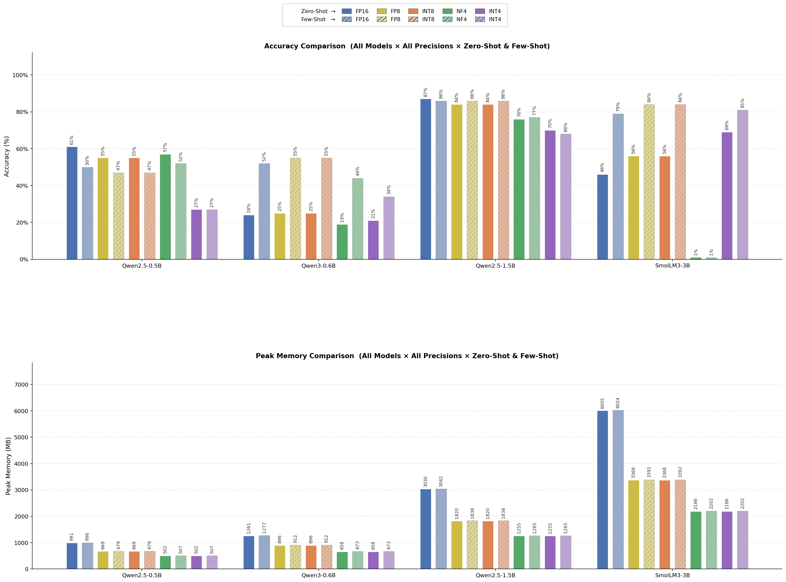
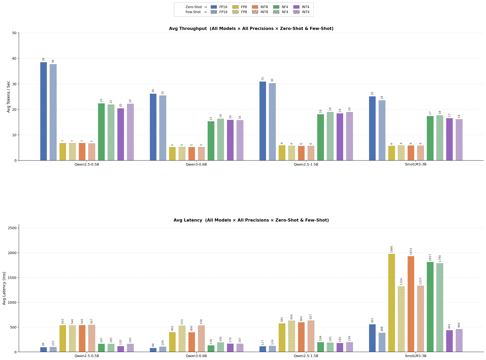

# Quantized Evaluation Observations Report

Date: 2026-06-18  
Scope: Full-dataset evaluation across 4 models, 4 quantization modes (int8, nf4, int4, fp8), and 2 prompting modes (zero-shot, few-shot), with fp16 baselines included for comparison.

## Included Figures

### 1) Accuracy + Peak Memory

### 2) Throughput + Latency

## Executive Summary

- Quantization consistently reduced peak memory usage relative to fp16, with 4-bit modes (nf4/int4) providing the largest memory savings.
- The latency/throughput relationship is not monotonic with bit-width in this setup: int8/fp8 were often slower than nf4/int4, likely due to kernel maturity and backend path differences in the current runtime stack.
- Accuracy behavior is model-dependent:
  - Some models tolerate low-bit quantization reasonably well.
  - Others show a sharp degradation on int4, especially in classification-style routing tasks with many candidate labels.
- Few-shot prompting improved some models (for example Qwen3-0.6B), but not all (for example Qwen2.5-0.5B), indicating that context formatting and demonstration quality likely matter as much as quantization level.

## Detailed Observations

1. Memory behavior is as expected and stable.

- fp16 had the highest peak memory footprint.
- int8/fp8 reduced memory materially.
- nf4/int4 produced the lowest peak memory among tested modes.

2. Speed behavior is backend-sensitive, not just precision-sensitive.

- int8/fp8 did not automatically deliver better throughput in this environment.
- nf4/int4 often showed better tokens/sec than int8/fp8 for these specific model sizes and serving path.
- This strongly suggests implementation/kernel effects dominate over theoretical arithmetic savings for these runs.

3. Accuracy impact differs by model and mode:

- Qwen2.5-0.5B:

  - int4 suffered a large accuracy drop (both zero-shot and few-shot).
  - nf4 preserved substantially more quality than int4 while maintaining low memory.

- Qwen3-0.6B:

  - Few-shot materially improved performance compared with zero-shot.
  - int8/fp8 were competitive with fp16 in few-shot accuracy for this model.

4. Few-shot is not universally beneficial.

- Some model/quant pairs improved with few-shot.
- Some pairs were flat or worse, implying prompt template sensitivity and possible overfitting to demonstration style.

5. Operational takeaway.

- If quality is priority, fp16 remains safest.
- If memory-constrained, nf4 appears to be a more stable low-bit default than int4 in this benchmark.
- int4 should be paired with adaptation/fine-tuning (for example QLoRA/AdaLoRA) rather than used directly without tuning.

## Focused Metrics For Proposed Next-Step Models

### Qwen2.5-0.5B (latest run snapshots)

Zero-shot:

- fp16: acc 0.61, mem 990.8 MB, 38.52 tok/s, 99.48 ms
- int8: acc 0.55, mem 669.5 MB, 6.87 tok/s, 544.91 ms
- nf4: acc 0.57, mem 502.2 MB, 22.42 tok/s, 167.01 ms
- int4: acc 0.27, mem 502.2 MB, 20.47 tok/s, 120.35 ms
- fp8: acc 0.55, mem 669.5 MB, 6.89 tok/s, 543.17 ms

Few-shot:

- fp16: acc 0.50, mem 996.5 MB, 37.73 tok/s, 103.02 ms
- int8: acc 0.47, mem 678.6 MB, 6.73 tok/s, 547.44 ms
- nf4: acc 0.52, mem 506.7 MB, 21.93 tok/s, 164.76 ms
- int4: acc 0.27, mem 506.7 MB, 22.23 tok/s, 164.75 ms
- fp8: acc 0.47, mem 678.6 MB, 6.83 tok/s, 539.87 ms

Interpretation:

- int4 base quality is too low for direct deployment on this task.
- QLoRA/AdaLoRA on int4 is a sensible next attempt to recover quality while keeping memory low.

### Qwen3-0.6B (latest run snapshots)

Zero-shot:

- fp16: acc 0.24, mem 1260.7 MB, 26.23 tok/s, 83.98 ms
- int8: acc 0.25, mem 896.3 MB, 5.32 tok/s, 400.18 ms
- nf4: acc 0.19, mem 658.2 MB, 15.36 tok/s, 135.61 ms
- int4: acc 0.21, mem 658.2 MB, 15.94 tok/s, 169.53 ms
- fp8: acc 0.25, mem 896.3 MB, 5.28 tok/s, 402.46 ms

Few-shot:

- fp16: acc 0.52, mem 1276.8 MB, 25.44 tok/s, 109.39 ms
- int8: acc 0.55, mem 912.3 MB, 5.31 tok/s, 536.20 ms
- nf4: acc 0.44, mem 673.3 MB, 16.37 tok/s, 191.63 ms
- int4: acc 0.34, mem 673.3 MB, 15.80 tok/s, 167.01 ms
- fp8: acc 0.55, mem 912.3 MB, 5.34 tok/s, 533.29 ms

Interpretation:

- This model is highly prompt-mode sensitive (large jump from zero-shot to few-shot).
- int4 loses quality vs fp16/fp8/int8 in few-shot, so adapter tuning is justified.

## Next Step (Proposal)

This seems directionally correct:

- fp16 -> LoRA
- int4 -> QLoRA
- int4 -> AdaLoRA

for only:

- Qwen2.5-0.5B
- Qwen3-0.6B

### Why this is the right next experiment

- It isolates two compact model families that are practical for rapid iteration.
- It compares a quality-oriented adapter baseline (fp16 LoRA) against low-memory adapters (int4 QLoRA/AdaLoRA).
- It directly tests whether adapter learning can recover the int4 quality gap seen in inference-only quantized runs.

### Suggested Experiment Matrix

For each model (2 models), train/evaluate 3 variants:

1. fp16 + LoRA
2. int4 + QLoRA
3. int4 + AdaLoRA

Total: 6 training runs (+ validation/inference sweeps).

### Success Criteria

- Primary: accuracy recovery relative to fp16 LoRA baseline.
- Secondary: memory and latency at inference.
- Deployment target recommendation:

  - If int4 QLoRA/AdaLoRA reaches within 2 to 4 accuracy points of fp16 LoRA while preserving memory advantage, prefer int4 adapter route.
  - If gap remains larger, keep fp16 LoRA for quality-critical paths.

### Practical Notes

- Keep prompt template fixed across all variants to avoid confounding.
- Use the same train/validation split and seed per model.
- Track calibration quality (for example confidence distribution and common confusion pairs), not only top-1 accuracy.
- For AdaLoRA, monitor rank allocation stability across epochs; unstable rank movement can hurt final consistency.

## Final Recommendation

Proceed with exactly the two-model, three-method matrix you proposed. It is the most informative next step with a favorable cost-to-insight ratio, and it directly addresses the observed int4 quality gap while preserving a clear fp16 quality anchor.
